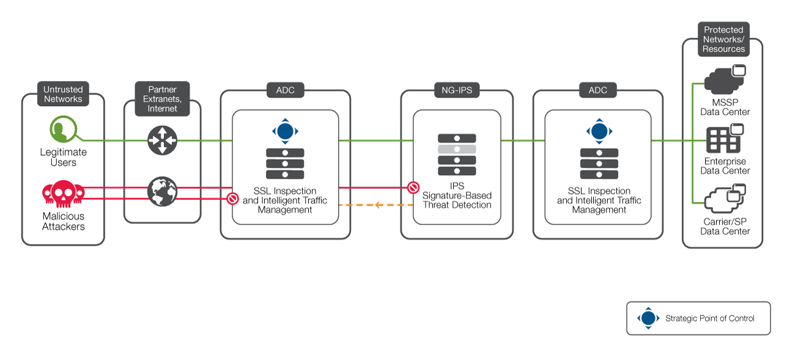

Introduction
============

(SSL_offloading_) is the process of removing the SSL-based encryption from incoming traffic to relieve a web server of the processing burden of decrypting or encrypting traffic sent via SSL. The processing is offloaded to a separate device designed specifically for SSL acceleration or SSL termination.

|image1|

The examples contained within this repository are designed to be run from their respective folder structure. To see the solution work, clone this repository, navigate to the example you would like to try, and use the instructions provided.

Example:

BIG-IP with Ansible

- clone repository
- navigate to /code/ansible
- follow instructions

.. _SSL_offloading: https://www.f5.com/services/resources/glossary/ssl-offloading
