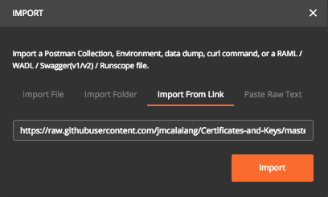

BIG-IP - Postman Collection
===========================

This Postman Collection and Environment Variable setup contains the needed pieces to bring in Certs and Keys to a BIG-IP via REST. Cert and Key needs to be available from URL source (http://key.key, http://cert.crt). Along with the import of the certificate & Key, this Collection can also be used for Client-SSL Profile creation and applying to a Virtual Server.

+-----------------------------+-----------------------------+
| Environment Variable        | Value                       |
+=============================+=============================+
| big_ip_mgmt                 | FQDN or IP of BIG-IP        |
+-----------------------------+-----------------------------+
| big_ip_auth_token           | AUTH Token                  |
+-----------------------------+-----------------------------+
| cert_location               | http://location_of_cert.crt |
+-----------------------------+-----------------------------+
| key_location                | http://location_of_cert.key |
+-----------------------------+-----------------------------+
| virtual_server              | Virtual Server Name         |
+-----------------------------+-----------------------------+
| new_client_ssl_profile      | Client SSL Profile Name     |
+-----------------------------+-----------------------------+

The easiest way to import the Collection and Environment into Postman is via the "Import from Link" option:

|image1|

Collection:
https://raw.githubusercontent.com/f5devcentral/f5-tls-automation/main/code/postman/Certificates%20and%20Keys.postman_collection.json

Environment:
https://raw.githubusercontent.com/f5devcentral/f5-tls-automation/main/code/postman/Certificates%20and%20Keys.postman_environment.json

