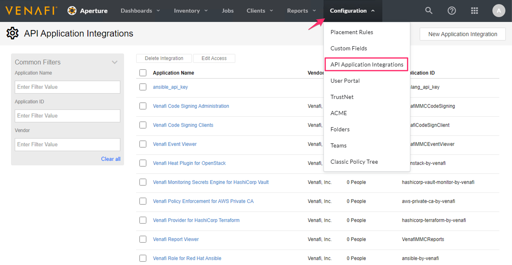
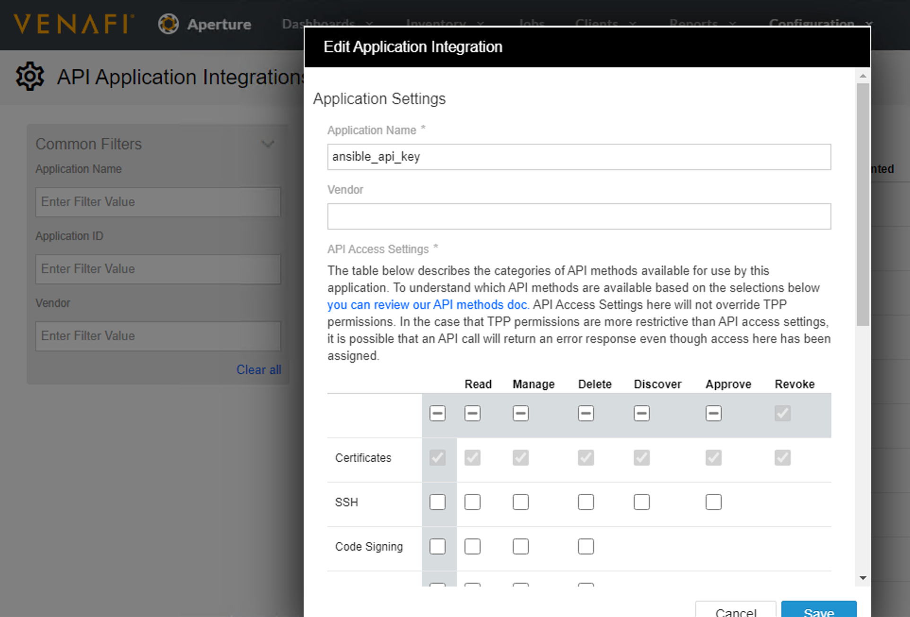

BIG-IP - Venafi
===============

.. note:: Tested with Ansible 2.10 and Venafi Trust Protection Platform 20.2

This task is designed to pull Certificates/Keys from a Venafi Trust Protection Platform and publish them into a BIG-IP.

For Ansible to interact with Venafi Trust Protection Platform you will need to create an API Application Integration.

Under Configuration locate the correct area and create an Application ID for access:

.. warning:: This example Application ID has all Certificate rights, this may be more then desired

|image1|

|image2|

Steps of the task:

- Pull Certificates/Key from Venafi API
- Store Certificates/Key in location
- Upload Certificates/Key to BIG-IP
- Create SSL Profile on BIG-IP
- Delete Certificates/Key from playbook path

.. warning:: This task will delete files, its designed this way, so Certificates/Keys are not left residually

Clone the repository to have the examples local, or copy the example code below. Task modification should not be necessary. However, you need to update the variables to your environment.

+------------------------+----------------------------------------------------------------+
| vars                   | Variables Needed for Task                                      |
+========================+================================================================+
| bigips:                | Array of BIG-IP Targets (IP or FQDN)                           |
+------------------------+----------------------------------------------------------------+
| provider:              | BIG-IP information                                             |
+------------------------+----------------------------------------------------------------+
| server:                | References ``bigips`` leave as default value ``'{{ item }}'``  |
+------------------------+----------------------------------------------------------------+
| user:                  | BIG-IP Username                                                |
+------------------------+----------------------------------------------------------------+
| password:              | BIG-IP Password                                                |
+------------------------+----------------------------------------------------------------+
| validate_certs:        | Validate BIG-IP Management Certificate                         |
+------------------------+----------------------------------------------------------------+
| server_port:           | BIG-IP Connectivity Port                                       |
+------------------------+----------------------------------------------------------------+
| partition:             | BIG-IP Partition for Objects                                   |
+------------------------+----------------------------------------------------------------+
| domain_name:           | FQDN of Certificate Object                                     |
+------------------------+----------------------------------------------------------------+
| state:                 | Object state ``present`` is create ``absent`` is delete        |
+------------------------+----------------------------------------------------------------+
| venafi:                | URL for Venafi Trust Protection Platform (IP or FQDN)          |
+------------------------+----------------------------------------------------------------+
| venafiuser:            | Venafi Username                                                |
+------------------------+----------------------------------------------------------------+
| venafipassword:        | Venafi Password                                                |
+------------------------+----------------------------------------------------------------+
| venaficlientid:        | API Application Integration Application ID                     |
+------------------------+----------------------------------------------------------------+
| venafiscopeid:         | Scope rights of API Application Integration object             |
+------------------------+----------------------------------------------------------------+
| certificatename:       | Name of Certificate to export from Venafi                      |
+------------------------+----------------------------------------------------------------+
| keypassphrase:         | Key Passphrase                                                 |
+------------------------+----------------------------------------------------------------+

Run: **ansible-playbook main.yml**

Task:

.. literalinclude :: main.yml
   :language: yaml

